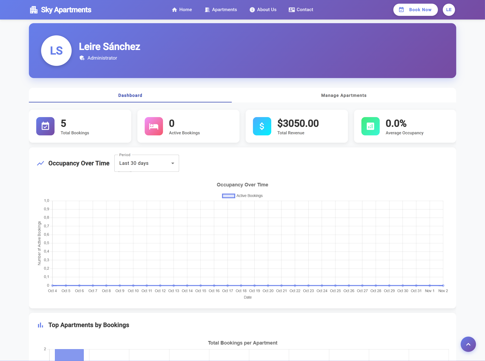
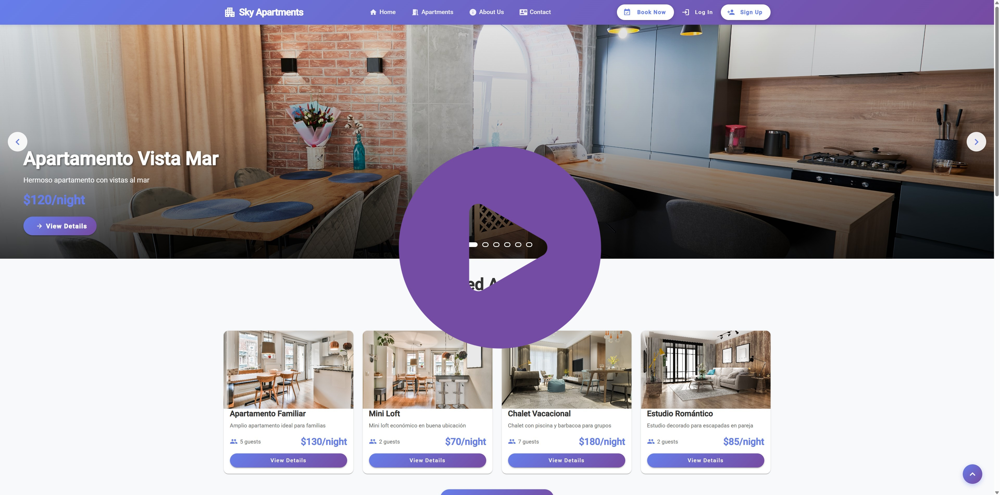

# Sky Apartments: Apartment Management Web Application

`Sky Apartments` is a web application designed to help apartment owner manage and showcase their properties and allow users to book apartments through a friendly and filtered interface. The application will support user roles such as guests, registered users, and administrators, offering different functionalities tailored to each profile.

## Version 0.1 - Current Features

Version 0.1 of Sky Apartments implements the core functionalities of the application:

**For Anonymous Users:**
- View the complete apartment catalog
- Advanced search system with combined filters and multiple criteria
- Filter by characteristics (number of guests, terrace/balcony, location, price range, etc.)
- Map integration to display exact apartment locations
- Detailed apartment information with images and descriptions
- Check availability for specific dates

**For Registered Users:**
- Registration and authentication on the platform
- Personal profile management
- Make reservations on available apartments
- View booking history
- Cancel active reservations

**For Administrators:**
- Access through system credentials
- Full apartment management (create, edit, delete)
- Upload images for apartments
- Manage all system bookings

## 📸 Screenshots

*Main view with available apartment listings*

*Detail page showing complete apartment information*

*Administration interface for apartment management*

*User personal area with booking history*

## 🎥 Demo

*1-minute video showcasing the main features of version 0.1*

---

## 🚧 Project Status

> ℹ️ **The application is under active development.** We are continuously working to add new features and improve the user experience.

## 🔮 Upcoming Versions

In the next iterations of Sky Apartments, we plan to implement:

- **Interactive calendar** showing real-time availability
- **Email notifications** for booking confirmations
- **Rating and review system** allowing users to share their experiences
- **Statistics dashboard** with charts for monthly bookings and most popular apartments
- **Dynamic pricing** adjusting prices based on season, occupancy, and booking lead time
- **Enhanced media gallery** with support for multiple images per apartment

---

## 📋 Table of contents

1. [Features](docs/readme%20sections/features01.md)
2. [Detailed Features](docs/readme%20sections/detailedFeatures01.md)
3. [Execution](docs/readme%20sections/execution.md)
4. [Development Guide](docs/readme%20sections/devGuide.md)
5. [Progress Tracking](docs/readme%20sections/progressTracking.md)
6. [Project Start](docs/readme%20sections/ProjectStart.md)
7. [Authors](docs/readme%20sections/author.md)

## 📄 License

This project is under license. See the [`LICENSE`](./LICENSE) file for details.
