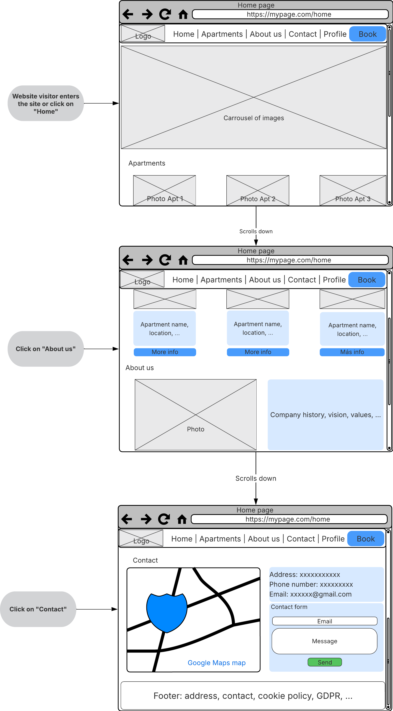
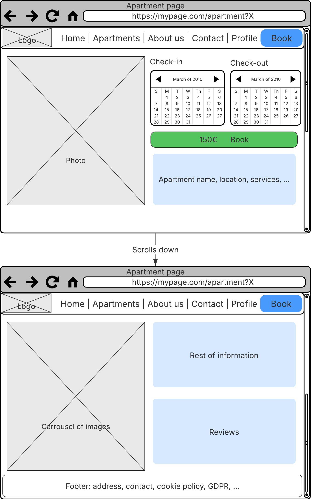

# Sky Apartments: Apartment Management Web Application

`Sky Apartments` is a web application designed to help apartment owner manage and showcase their properties and allow users to book apartments through a friendly and filtered interface. The application will support user roles such as guests, registered users, and administrators, offering different functionalities tailored to each profile.

---

## Project status

> ⚠️ This document clearly states that only the **functional** and **technical** objectives of the application have been defined, and that development has started. However, the implementation is not yet functional.

---

## 📋 Table of contents

1. [Objectives](docs/readme%20sections/objectives.md)
2. [Methodology](docs/readme%20sections/methodology.md)
3. [Features](docs/readme%20sections/features.md)
4. [Analysis](docs/readme%20sections/analysis.md)
5. [Progress Tracking](docs/readme%20sections/progressTracking.md)
6. [Authors](docs/readme%20sections/author.md)
7. [Development Guide](docs/readme%20sections/devGuide.md)

## 📄 License

This project is under license. See the [`LICENSE`](./LICENSE) file for details.
