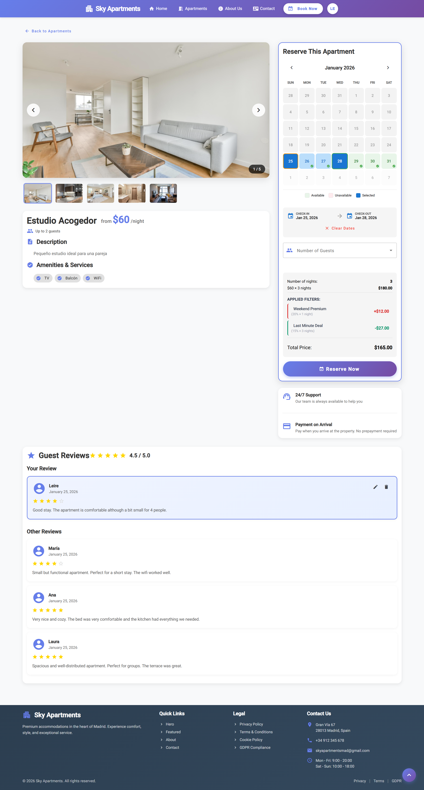
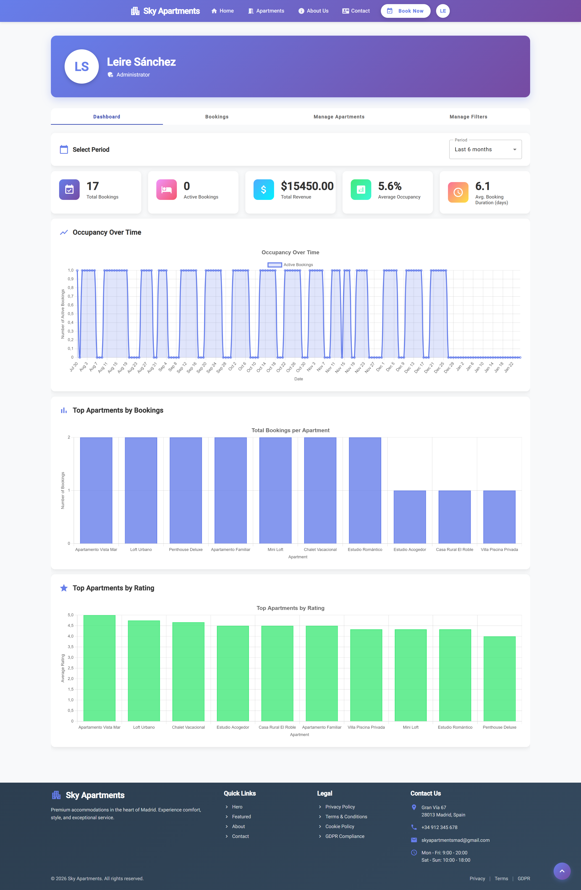
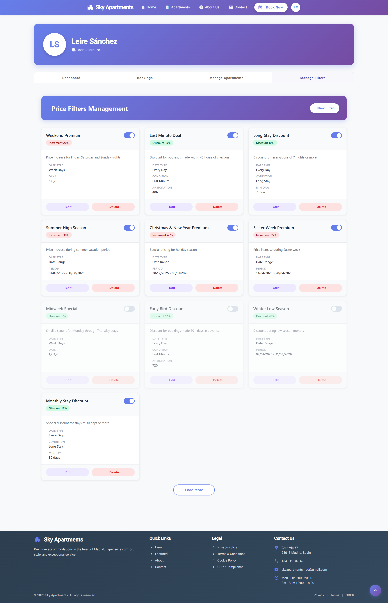
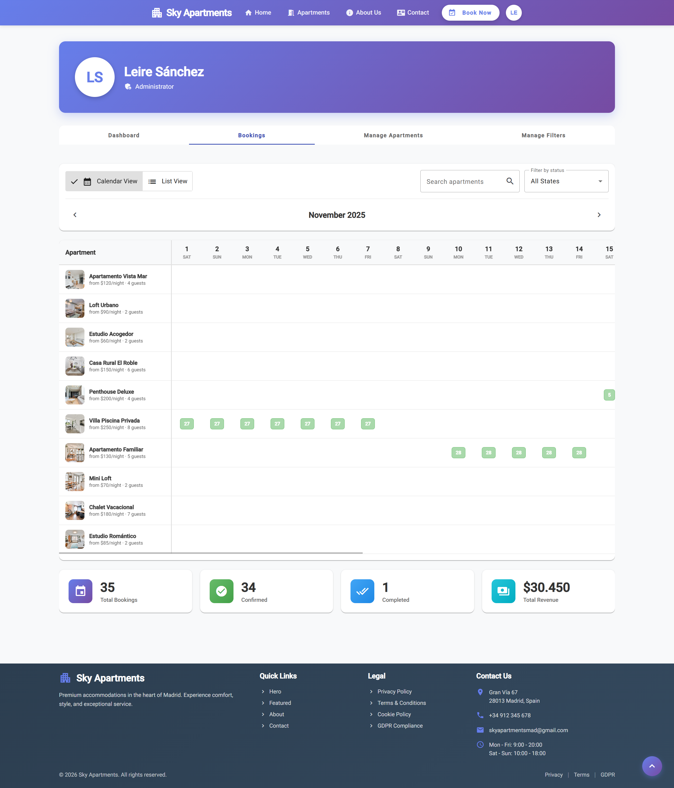
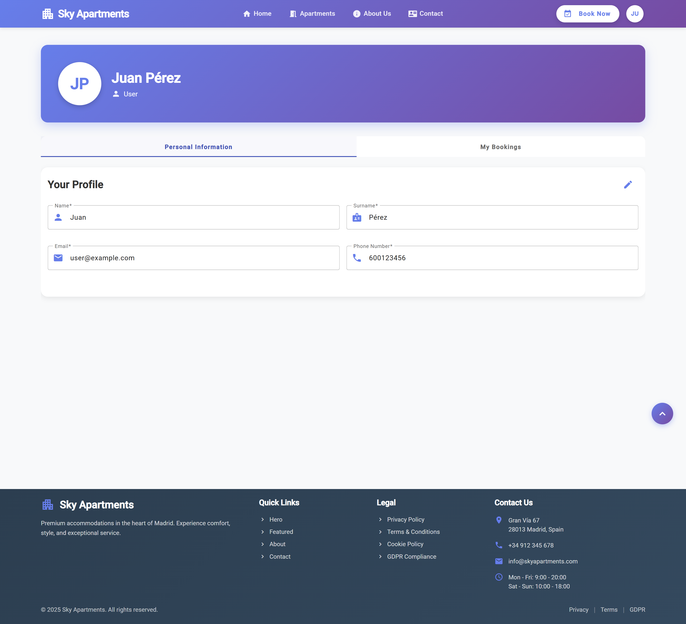
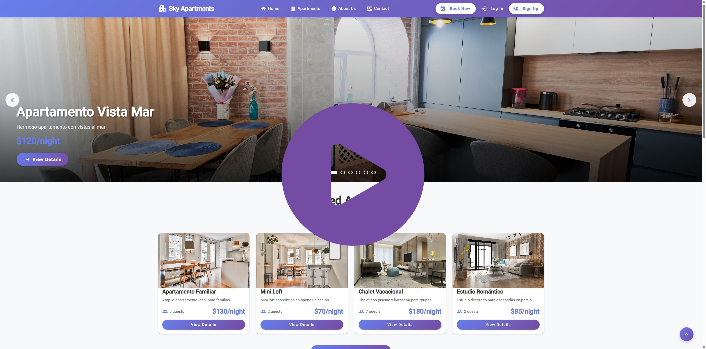

# Sky Apartments: Apartment Management Web Application

`Sky Apartments` is a web application designed to help apartment owner manage and showcase their properties and allow users to book apartments through a friendly and filtered interface. The application will support user roles such as guests, registered users, and administrators, offering different functionalities tailored to each profile.

## Version 1.0 - Full Release

Version 1.0 of Sky Apartments delivers a complete, production-ready apartment management and booking system with all core features implemented:

**For Anonymous Users:**
- View the complete apartment catalog with pagination
- Advanced search system with combined filters and multiple criteria
- Filter by characteristics (number of guests, terrace/balcony, parking, pool, etc.)
- **Filter by minimum rating** to find top-rated apartments and availability
- Map integration to display apartments location
- Detailed apartment information with image gallery and description
- Check availability for specific dates
- **Interactive calendar** with real-time availability visualization
- Display **average rating** on apartment cards
- Display **rating** and **reviews** on apartment detail page

**For Registered Users:**
- Secure registration and authentication on the platform
- Personal profile management with editable information
- Make reservations on available apartments
- View complete booking history with status indicators
- Cancel active reservations
- **Review past stays** and rate apartments (1-5 stars)
- **Email notifications** for booking confirmations, cancellations, and updates and Check-in reminders

**For Administrators:**
- Secure access through system credentials
- **Comprehensive Statistics Dashboard** with key metrics:
    - Number of bookings (total and active)
    - Total revenue generated
    - Average occupancy rate
    - Average booking duration
    - Revenue per date range
    - Occupancy over time (interactive chart)
    - Top 10 most booked apartments (visual chart)
    - Top 10 apartments by rating (visual chart)

- **Full apartment management** (create, edit, delete):
    - Complete apartment information forms
    - Amenities configuration
    - Dynamic pricing configuration:
        - Base price per apartment
        - Price multipliers for weekends vs. weekdays
        - Seasonal pricing (low, medium, high season)
        - Occupancy-based pricing adjustments
        - Last-minute and advance booking modifiers
        - Special pricing for holidays and events
        - Long-stay discounts
    - Enhanced media gallery with support for multiple images per apartment
    - Image upload and deletion capabilities

- **Booking management**:
    - View all system bookings with advanced filters
    - Filter by status (pending, confirmed, cancelled, completed)
    - Filter by date range
    - Search by apartment

## 📸 Screenshots

*Main view with available apartment listings*

*Detail page showing complete apartment information, image gallery, and user reviews*

*Administration interface for apartment management*

*Administration interface for apartment management*

*Administration interface for apartment management*

*User personal area with booking history*

## 🎥 Demo

*Video showcasing the main features of version 1.0*

## 🚀 Access Link

[Access Sky Apartments Live](https://13.60.118.214:443)

> 📝 **Note:** Since the application uses a self-signed certificate for HTTPS (port 443) through the API Gateway, you might need to accept the browser security warning to proceed.

---

## ✨ What's New in Version 1.0

### Complete Feature Set

- ✅ All core functionality fully implemented and tested
- ✅ Dynamic pricing system with intelligent price adjustments
- ✅ Rating and review system fully operational
- ✅ Comprehensive email notification system
- ✅ Check-in reminder notifications
- ✅ Filter by minimum rating capability
- ✅ Enhanced admin panel with complete booking management
- ✅ Full statistics dashboard with visual charts and price analytics
- ✅ Production-ready deployment

### Dynamic Pricing Features

- ✅ Base price configuration per apartment
- ✅ Automatic price multipliers based on:
    - Day of the week (weekends vs. weekdays)
    - Season (low, medium, high)
    - Occupancy percentage
    - Booking lead time (last-minute vs. advance)
- ✅ Special pricing for holidays and events
- ✅ Discounts for long stays
- ✅ Price history and analytics in admin dashboard

### Technical Achievements

- ✅ RESTful API following industry best practices
- ✅ Secure HTTPS communication
- ✅ Role-based access control with Spring Security
- ✅ Dockerized application for easy deployment
- ✅ Published on DockerHub for distribution
- ✅ Custom error pages matching application design
- ✅ Pagination and filtering for optimal performance
- ✅ Sample data for immediate testing and demonstration

## 🔮 Future Enhancements
While Version 1.0 delivers a complete and fully functional application, potential future enhancements could include:

- Additional User Features:
    - Wishlist/favorite apartments
    - Advanced user preferences and saved searches
    - Social media integration for sharing
    - Multi-language support
    - In-app messaging between users and administrators
- Enhanced Analytics:
    - Predictive occupancy models using machine learning
    - Revenue forecasting tools
    - Market trend analysis and competitive insights
    - Customer segmentation and behavior analysis
    - Automated reporting and recommendations
- Extended Integrations:
    - Payment gateway integration
    - Calendar synchronization (Google Calendar, iCal)
    - Third-party booking platform integrations
    - Property management system (PMS) connections
    - Booking reminders before check-in date

---

## 📚 Project Documentation (LaTeX)

This project includes a comprehensive technical report (memoir) written in LaTeX. 

If you want to read, edit, and compile the PDF yourself using **Visual Studio Code**, follow these steps:

1. **Install a LaTeX distribution** on your computer if you don't have one already:
   - **Windows:** [MiKTeX](https://miktex.org/) or TeX Live
   - **macOS:** [MacTeX](https://www.tug.org/mactex/)
   - **Linux:** TeX Live (e.g., `sudo apt install texlive-full`)
2. **Install the VS Code Extension:** Search for and install the **"LaTeX Workshop"** extension (by James Yu) in VS Code.
3. **Compile the PDF:**
   - Open the main `.tex` file of the memoir in VS Code.
   - Save the file (`Ctrl + S` / `Cmd + S`) to trigger the auto-build.
   - Alternatively, you can click the green **"Build LaTeX project"** play button in the top right corner, or use the shortcut `Ctrl + Alt + B` (or `Cmd + Option + B` on macOS).

---

## 📋 Table of contents

1. [Features v0.1](docs/readme%20sections/features01.md)
2. [Features v0.2](docs/readme%20sections/features02.md)
3. [Features v1.0](docs/readme%20sections/features10.md)
4. [Detailed Features](docs/readme%20sections/detailedFeatures01.md)
5. [Execution](docs/readme%20sections/execution.md)
6. [Development Guide](docs/readme%20sections/devGuide.md)
7. [Progress Tracking](docs/readme%20sections/progressTracking.md)
8. [Project Start](docs/readme%20sections/ProjectStart.md)
9. [Authors](docs/readme%20sections/author.md)

## 📄 License

This project is under license. See the [`LICENSE`](./LICENSE) file for details.

🎯 Project Status: Production Ready

> ✅ Version 1.0 is complete and production-ready. All planned features including the dynamic pricing system have been implemented, tested, and are fully functional. The application is ready for real-world deployment and use.
