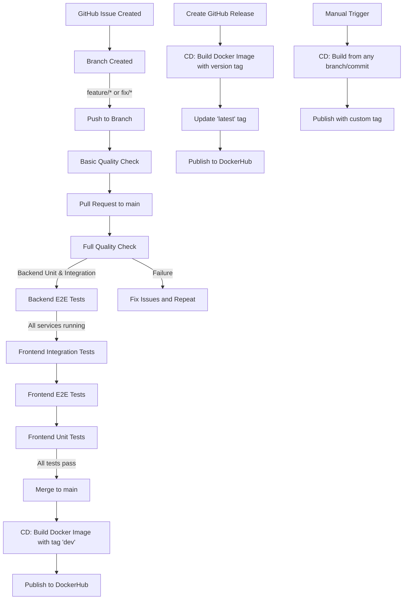

# 👨‍💻 Development Guide

## 📊 Table of Contents

1. [Introduction](#-introduction)
2. [Technology Stack](#-technology-stack)
3. [Tools](#️-tools)
4. [Architecture](#️-architecture)
5. [Quality Assurance](#-quality-assurance)
6. [Deployment and Distribution](#deployment-and-distribution)
7. [Development Process](#-development-process)
8. [Code Execution and Environment Setup](#️-code-execution-and-environment-setup)

---

## 🚀 Introduction

### 📖 Overview

This application is a **web application** with a **SPA (Single Page Application)** architecture on the client side, developed with **Angular 19**.  
A SPA is an application where content and navigation are mainly managed on the client side, loading a single initial HTML page and dynamically updating views using JavaScript, without fully reloading the page on each interaction.

The **backend** is implemented with **Spring Boot**, providing a REST API that allows the frontend to interact with business logic and the database.

The **database** used is **MySQL**.

The architecture is **microservices-based**, organized into multiple independent services:

- **Client (frontend):** Angular application running in the browser.
- **Server (backend):** Multiple Spring Boot microservices including:
  - **Apartment Service:** Manages apartment-related operations
  - **User Service:** Handles user authentication and management
  - **Booking Service:** Processes reservation operations
  - **Eureka Server:** Service discovery and registry
  - **API Gateway:** Single entry point for client requests
- **Database:** MySQL, accessed by each microservice via JPA/Hibernate.

Communication between client and server occurs exclusively via **REST API** over **HTTPS** through the **API Gateway** on port **443**.

### 📝 Summary

| Item                    | Description                                                                       |
|-------------------------|-----------------------------------------------------------------------------------|
| **Type**                | Web SPA with Microservices REST API                                               |
| **Frontend**            | Angular 19                                                                        |
| **Backend**             | Spring Boot Microservices                                                         |
| **Database**            | MySQL                                                                             |
| **Architecture**        | Microservices with Maven Multi-module                                             |
| **Communication**       | REST API (HTTPS/JSON) via API Gateway                                             |
| **Service Discovery**   | Netflix Eureka                                                                    |
| **API Gateway**         | Spring Cloud Gateway (port 443)                                                   |
| **Distributed Tracing** | Jaeger                                                                            |
| **Security**            | JWT (JSON Web Tokens)                                                             |
| **Cloud Storage**       | AWS S3                                                                            |
| **Deployment Env**      | Docker containers                                                                 |
| **Quality Control**     | Unit, integration and E2E tests                                                   |
| **Development Process** | Iterative and incremental, version control with Git and CI/CD with GitHub Actions |

---

## 🧰 Technology Stack

The application uses the following technologies for its execution:

### **Frontend**

- **[Angular 19](https://angular.io/)** — A Single Page Application (SPA) framework used to build the client-side of the application. In this project, Angular manages the UI rendering, routing, and state management, allowing the user to interact with the system without full page reloads.
- **[RxJS](https://rxjs.dev/)** — A library for reactive programming using observables. In this project, RxJS is used to handle asynchronous data streams from the backend, such as API calls.
- **[Zone.js](https://www.npmjs.com/package/zone.js?activeTab=readme)** — A library that helps Angular detect changes in the application state by intercepting and tracking asynchronous operations, ensuring the UI updates automatically when data changes.

### **Backend**

- **[Spring Boot](https://spring.io/projects/spring-boot)** —  A Java-based framework that simplifies backend application development with pre-configured defaults and embedded server support. In this project, it handles REST API endpoints, request processing, and business logic across multiple microservices.

    - **spring-boot-starter-web** —  Provides the components required to build REST APIs and serve HTTP requests.
    - **spring-boot-starter-data-jpa** — Enables integration with JPA and Hibernate for database access and object-relational mapping.
    - **spring-boot-devtools** — Adds hot reload and development-time features to speed up backend development.

- **[Spring Cloud Netflix Eureka](https://spring.io/projects/spring-cloud-netflix)** — Service discovery solution that allows microservices to register themselves and discover other services dynamically. The Eureka Server acts as a registry for all microservices in the application.
- **[Spring Cloud Gateway](https://spring.io/projects/spring-cloud-gateway)** — API Gateway that provides a single entry point for all client requests, routing them to the appropriate microservices. Operates on HTTPS port 443.
- **[Spring Security](https://spring.io/projects/spring-security)** — Framework for authentication and authorization. Used across all microservices to secure endpoints and validate JWT tokens.
- **[JWT (JSON Web Tokens)](https://www.jwt.io/introduction)** — Token-based authentication mechanism using the JJWT library (jjwt-api, jjwt-impl, jjwt-jackson) for secure communication between client and microservices.
- **[MySQL](https://www.mysql.com/)** — A relational database management system used to store persistent application data, including user information and business records.
- **MySQL Connector/J** — The official JDBC driver that allows the Spring Boot backend to connect and interact with the MySQL database.
- **[AWS S3 SDK v2](https://aws.amazon.com/es/sdk-for-java/)** — Amazon Web Services SDK for Java, used in the Apartment Service to store and retrieve apartment images and related media files.
- **[Jaeger](https://www.jaegertracing.io/)** — Distributed tracing system used to monitor and troubleshoot transactions across microservices, providing visibility into request flows and performance bottlenecks.

### **Testing**

- **[JUnit 5](https://junit.org/junit5/)** — The primary framework for writing and running unit tests in the backend. Used to validate individual components of the application logic.
- **[Mockito](https://site.mockito.org/)** — A mocking framework for creating fake objects in unit tests, allowing isolated testing of backend services without requiring real dependencies.
- **[Testcontainers](https://www.testcontainers.org/)** — A Java library to run lightweight, disposable containers for integration testing. In this project, it is used to spin up MySQL instances during tests.
- **[Rest Assured](https://rest-assured.io/)** — A Java DSL for testing REST APIs. Used to verify backend endpoints by simulating client requests and validating responses.
- **[Karma](https://karma-runner.github.io/)** — A JavaScript test runner that executes frontend tests in real browsers, ensuring compatibility and correct behavior in a browser environment.
- **[Jasmine](https://jasmine.github.io/)** — A behavior-driven testing framework for JavaScript. Used with Karma to write and structure frontend unit tests for Angular components and services.
- **[Playwright](https://playwright.dev/)** — A framework for end-to-end testing. In this project, Playwright is used to simulate real user interactions with the Angular application and validate full workflows.

---

## 🛠️ Tools

The following tools and IDEs are used to develop the application. Only the ones relevant to the development process are listed, and their role in this specific project is explained.

- **[Visual Studio Code](https://code.visualstudio.com/)** — A lightweight, extensible code editor used for writing and editing both frontend (Angular) and backend (Spring Boot) code. Its integrated terminal and plugin ecosystem streamline the development process.
- **[Postman](https://www.postman.com/)** — An API development and testing tool used to send requests to backend REST APIs and verify responses during development and debugging.
- **[Docker Desktop](https://www.docker.com/products/docker-desktop/)** — A containerization platform used to run MySQL databases locally for development and testing. It also supports running backend services in containers if needed.
- **[Git](https://git-scm.com/)** — A distributed version control system for tracking changes in the source code and enabling collaboration between developers.
- **[GitHub](https://github.com/)** — A cloud-based platform for hosting the Git repository, managing code versions, and integrating Continuous Integration (CI) workflows.
- **[JaCoCo](https://www.jacoco.org/jacoco/)** — A Java code coverage library used to measure how much of the backend code is exercised by automated tests. It helps monitor testing quality and identify untested parts of the application.
- **[Maven](https://maven.apache.org/)**— A build automation and dependency management tool used to manage the multi-module project structure and compile the microservices.

---

## 🏗️ Architecture

### **Domain Model**

The following diagram illustrates the core domain entities and their relationships:


---

### **Server Architecture**

The backend follows a microservices architecture with multiple independent services communicating through REST APIs:


---

### **Client Architecture**

The frontend is built with Angular 19 following a component-based architecture:


---

### **Deployment Architecture**

The application follows a **microservices architecture** using **Maven multi-module** project structure with the following components:

#### **Frontend (Angular 19 SPA)**
- Runs in a Node.js-based development server during development and is built into static files for production.
- Communicates exclusively with the backend via **HTTPS** on port **443** through the API Gateway.

#### **Backend Microservices (Spring Boot)**

The backend is organized as a Maven multi-module project with the following modules:

1. **Apartment Service**
   - Manages apartment listings, details, and images
   - Integrates with AWS S3 for media storage
   - Registers with Eureka Server for service discovery
   - Secured with JWT authentication

2. **User Service**
   - Handles user registration, authentication, and profile management
   - Issues and validates JWT tokens
   - Registers with Eureka Server for service discovery
   - Secured with Spring Security

3. **Booking Service**
   - Processes apartment reservations and bookings
   - Communicates with other microservices as needed
   - Registers with Eureka Server for service discovery
   - Secured with JWT authentication

4. **Eureka Server**
   - Service registry and discovery server
   - All microservices register themselves on startup
   - Enables dynamic service location

5. **API Gateway**
   - Single entry point for all client requests (HTTPS port 443)
   - Routes requests to appropriate microservices
   - Handles load balancing and request filtering
   - First point of authentication/authorization

Each microservice runs as an independent Spring Boot application with its own database schema.

**Communication Protocols:**

- **Frontend → API Gateway:** HTTPS REST calls in JSON format (port 443)
- **API Gateway → Microservices:** HTTP REST calls via Eureka service discovery
- **Microservices → Database:** JDBC protocol using the MySQL Connector/J driver
- **Microservices ↔ Microservices:** HTTP REST calls
- **Distributed Tracing:** Jaeger collects traces across all microservices

**Security:**
- JWT tokens issued by User Service
- All microservices validate JWT tokens using shared secret
- Spring Security configured on all microservices
- HTTPS communication between frontend and API Gateway


### **REST API**

The backend REST API is defined using **OpenAPI** specification.  
A generated **HTML version** of the documentation is available for direct viewing on GitHub without executing the application:

📄 **[View REST API Documentation of Apartment MS](https://rawcdn.githack.com/codeurjc-students/2025-sky-apartments/14d3b8216f39521555db9dc96a4bed471fdeaf7b/docs/api/api-docs-apartment.html)**
📄 **[View REST API Documentation of User MS](https://rawcdn.githack.com/codeurjc-students/2025-sky-apartments/14d3b8216f39521555db9dc96a4bed471fdeaf7b/docs/api/api-docs-user.html)**
📄 **[View REST API Documentation of Booking MS](https://rawcdn.githack.com/codeurjc-students/2025-sky-apartments/14d3b8216f39521555db9dc96a4bed471fdeaf7b/docs/api/api-docs-booking.html)**

### **Distributed Tracing**

The application uses **Jaeger** for distributed tracing, allowing developers to visualize request flows across microservices and identify performance bottlenecks. Traces include information about:
- Request routing through the API Gateway
- Inter-service communication


---

## ✅ Quality Assurance

### 🧪 Backend

The backend microservices have undergone several layers of automated testing to ensure reliability, maintainability, and correctness of the implemented features across all services.

#### **Types of Test**

- **Unit Tests** — Validating the logic of individual service classes in isolation.  
  - Example: `ApartmentService`, `UserService`, and `BookingService` tested using **Mockito** to mock the repository layer.
- **Integration Tests** — Testing service behavior with a real database connection.  
  - Example: Each microservice tested using **Testcontainers** with a **MySQL** container to validate database interactions.
- **End-to-End (E2E) Tests** — Validating the full API functionality through the API Gateway with all microservices running.  
  - Example: REST endpoints tested using **Rest Assured** against a running instance of the complete microservices architecture (API Gateway, Eureka Server, and all microservices).
  - Tests authenticate through the User Service and validate cross-service workflows.
  - Requires all backend services to be running before test execution.

#### **Test Coverage by Microservice**

##### **Apartment Service**

| Metric                | Value         |
|-----------------------|--------------|
| **Line Coverage**     | 83% (318/1971 instructions missed) |
| **Branch Coverage**   | 70% (18/60 branches missed)        |
| **Number of Classes** | 22            |
| **Number of Methods** | 135 total, 3 missed              |

**Coverage by Package:**

| Package | Line Coverage | Branch Coverage |
|---------|--------------|----------------|
| `com.skyapartments.apartment.dto`        | 83% | 75% |
| `com.skyapartments.apartment.model`      | 100% | N/A |
| `com.skyapartments.apartment.service`    | 97%| 85% |
| `com.skyapartments.apartment.controller` | 91%| 100% |
| `com.skyapartments.apartment.exception` | 84%| N/A |

##### **User Service**

| Metric                | Value         |
|-----------------------|--------------|
| **Line Coverage**     | 81% (212/1720 instructions missed) |
| **Branch Coverage**   | 66% (19/56 branches missed) |
| **Number of Classes** | 22 |
| **Number of Methods** | 143 total, 0 missed  |

**Coverage by Package:**

| Package | Line Coverage | Branch Coverage |
|---------|--------------|----------------|
| `com.skyapartments.user.dto`        | 100% | N/A |
| `com.skyapartments.user.model`      | 94% | N/A |
| `com.skyapartments.user.service`    | 96% | 69% |
| `com.skyapartments.user.controller` | 84% | 83% |
| `com.skyapartments.user.exception`   | 86% | N/A |

##### **Booking Service**

| Metric                | Value         |
|-----------------------|--------------|
| **Line Coverage**     | 75% (413/1660 instructions missed) |
| **Branch Coverage**   | 65% (23/66 branches missed)  |
| **Number of Classes** | 22 |
| **Number of Methods** | 142 total, 46 missed |

**Coverage by Package:**

| Package | Line Coverage | Branch Coverage |
|---------|--------------|----------------|
| `com.skyapartments.booking.dto`        | 61% | N/A |
| `com.skyapartments.booking.model`      | 100% | N/A |
| `com.skyapartments.booking.service`    | 87% | 69% |
| `com.skyapartments.booking.controller` | 83% | 84% |
| `com.skyapartments.user.exception`   | 73% | N/A |

#### **Coverage Report Screenshots**

**Apartment Service:**


**User Service:**


**Booking Service:**


Coverage reports are generated using **JaCoCo** and can be found in the `target/site/jacoco` directory of each microservice.


### 🧪 Frontend

The frontend has been tested at three different levels: **unit testing**, **integration testing**, and **end-to-end (E2E) testing**.  
The goal of these tests is to ensure the correct functionality of individual components, service integration, and the overall user flow.

#### **Types of Test**

- **Unit Tests** — Validating the logic of individual components in isolation using a virtual DOM and mocked services.  
  - Example: Testing `ApartmentListComponent` with mocked `ApartmentService` using **Jasmine** and **Karma**.  
- **Integration Tests** — Testing component and service interactions using **TestBed** with real HTTP communication to the API Gateway.  
  - Example: Testing `BookingComponent` with **TestBed** to validate service layer integration.  
- **End-to-End (E2E) Tests** — Validating the complete user flow in the browser.  
  - Example: Booking flow tested using **Playwright** from UI actions to backend responses through the API Gateway.  

#### **Coverage Metrics - Unit & Integration Tests**

Frontend test coverage is generated using **Karma + Istanbul** with the command:
```bash
ng test --code-coverage
```

This generates a coverage report in `frontend/coverage/frontend` folder.

##### **Coverage Summary**

|Type      |Coverage|
|----------|--------|
|Lines     | 93.8%   |
|Functions | 94.28%   |
|Branches  | 81.76%   |
|Statements| 93.84%   |


#### **End-to-End (E2E) Tests**

E2E tests validate the complete user workflows including:
- User authentication through the API Gateway
- Apartment browsing and filtering
- Booking creation and management
- Cross-microservice interactions

**Prerequisites:**
- Backend microservices must be running
- API Gateway must be accessible at `https://localhost:443`

Executed with:
```bash
npx playwright test
```

To open the interactive report:
```bash
npx playwright show-report
```


---

## Deployment and Distribution

The application follows a containerized deployment strategy using **Docker** and **Docker Compose** for orchestration.

### **🔹 Packaging Strategy**

The application is packaged as a **unified Docker image** that contains:
- **All backend microservices**: Eureka Server, API Gateway, User Service, Apartment Service, and Booking Service
- **Frontend application**: Angular SPA built as static files and served through the backend

This approach simplifies deployment by providing a single artifact that encapsulates the entire application.

### **🔹 Multi-Container Orchestration**

While the application logic is packaged in a single image, the complete system requires multiple containers coordinated through **Docker Compose**:

**Core Services:**
- **Application Container**: Runs all microservices and serves the frontend
- **MySQL Containers**: Separate database instances for User, Apartment, and Booking services
- **MinIO Container**: S3-compatible object storage for apartment images and media
- **Jaeger Container**: Distributed tracing system for monitoring

**Service Coordination:**
- Docker Compose manages container lifecycle and dependencies
- Health checks ensure proper startup order
- Network isolation and service discovery through Docker networking
- Volume management for data persistence

### **🔹 Distribution**

The application image and Docker Compose files are distributed through **DockerHub**:

**📦 DockerHub Repository:** `eloydsdlh/apartments-app`

**Available Tags:**
- `latest` → Latest stable release
- `0.1`, `0.2`, etc. → Specific version releases
- `dev` → Latest development build from `main` branch
- `<branch>-<timestamp>-<commit>` → Manual builds for testing

**Docker Compose as OCI Artifact:**
The `docker-compose.yml` file is also published as an OCI artifact on DockerHub, allowing users to pull the complete orchestration configuration:
```bash
# Pull and use the compose file directly from DockerHub
docker compose pull eloydsdlh/apartments-app:0.1
```

### **🔹 Deployment Options**

**Option 1: Docker Compose (Recommended for development/small deployments)**
```bash
# Pull the latest stable version
docker pull eloydsdlh/apartments-app:latest

# Run with Docker Compose
cd docker
docker compose up -d
```

**Option 2: Docker Compose with specific version**
```bash
# Pull a specific version
docker pull eloydsdlh/apartments-app:0.1

# Update docker-compose.yml to use the desired version
docker compose up -d
```

**Option 3: Standalone Docker (not recommended)**
```bash
# Running the application container alone (requires external MySQL and MinIO)
docker run -d \
  -p 443:443 \
  -e MYSQL_USERS_DB=user_db \
  -e MYSQL_APARTMENTS_DB=apartment_db \
  -e MYSQL_BOOKINGS_DB=booking_db \
  --name skyapartments \
  eloydsdlh/apartments-app:latest
```

### **🔹 Future Deployment Options**

While currently the application is designed for Docker Compose deployment, the microservices architecture enables future migration to:

- **Kubernetes**: Each microservice can be deployed as independent pods with Kubernetes service discovery replacing Eureka
- **Container orchestration platforms**: AWS ECS, Azure Container Instances, Google Cloud Run
- **Serverless architectures**: Individual microservices could be adapted for AWS Lambda or Azure Functions

The current Docker-based approach provides:
- ✅ Simplified local development
- ✅ Consistent environments across development, testing, and production
- ✅ Easy version management and rollbacks
- ✅ Minimal infrastructure requirements
- ✅ Quick setup and deployment (single `docker compose up` command)

### **🔹 Accessing the Published Artifacts**

**DockerHub Image:**
- URL: `https://hub.docker.com/r/eloydsdlh/apartments-app`
- Pull command: `docker pull eloydsdlh/apartments-app:latest`

**Docker Compose OCI Artifact:**
- URL: `https://hub.docker.com/r/eloydsdlh/apartments-compose`
- Tags available: `latest`, `dev`, `0.1`, etc.


---

## 🔄 Development Process

The development of the application followed an **iterative and incremental process**, inspired by the **Agile Manifesto** principles.

Although the project does not strictly follow Scrum or Kanban, some **Extreme Programming (XP)** practices were applied, such as continuous integration, automated testing, and short development iterations.

---

## 1. Task Management

Task management was handled using **GitHub Issues** and **GitHub Projects**, supported by a **visual Kanban board**.  
This allowed clear tracking of requirements, prioritization of tasks, and progress monitoring.

- **GitHub Issues** → Used to register bugs, enhancements, and new features.  
- **GitHub Projects (Kanban board)** → Provided a visual workflow with columns such as *To Do*, *In Progress*, and *Done*.  

📸 *Example of GitHub Project board:*  


---

## 2. Git Workflow

Version control was managed using **Git** with a **branching strategy** based on *feature branches*, *fix branches*, and *main branch protection*.

- **`main` branch** → Stable branch, always deployable.  
- **Feature branches** (`feature/*`) → Created for each new functionality.  
- **Fix branches** (`fix/*`) → Created for bug resolution.  
- **Other branches** (`testing/*`, `ci/*`, `docs/*`) → Used for uploading documentation, testing, or workflow configuration.  
- **Pull Requests** → Enforced code reviews and CI execution before merging.

---

## 3. Continuous Integration (CI)

The project used **GitHub Actions** for continuous integration.  
Multiple workflows were defined to ensure code quality at different stages:

### 🔹 Basic Quality Check

- Triggered on pushes to `feature/*`, `fix/*`, `testing/*`, and `ci/*`.
- Runs **basic unit tests** for all backend microservices and frontend.  

**Jobs:**

- `backend-basic` → Executes unit tests for all microservices (Apartment, User, Booking).
- `frontend-basic` → Installs dependencies and runs frontend unit tests (`npm run test:unit`).  

---

### 🔹 Full Quality Check

- Triggered on pull requests to `main` and can be manually dispatched.
- Executes **all test types** in a comprehensive testing pipeline with the following sequential jobs:

**Jobs:**

1. **`backend-unit-integration`**  
   - Runs **unit tests** for all microservices (`mvn test -Dtest='*UnitTest'`)
   - Runs **integration tests** for all microservices (`mvn test -Dtest='*IntegrationTest'`)
   - Uses **Testcontainers** with MySQL for integration testing

2. **`backend-e2e`** (depends on `backend-unit-integration`)
   - Builds all backend microservices
   - Starts complete infrastructure using **Docker Compose**:
     - MySQL databases for each microservice
     - MinIO for object storage
     - Eureka Server for service discovery
     - API Gateway for routing
     - All microservices (User, Apartment, Booking)
     - Jaeger for distributed tracing
   - Waits for all services to register with Eureka and become healthy
   - Executes **E2E tests** for each microservice:
     - Booking Service E2E tests
     - Apartment Service E2E tests
     - User Service E2E tests
   - Tests validate cross-service communication through the API Gateway
   - Provides detailed service logs on failure for debugging

3. **`frontend-integration`** (depends on `backend-e2e`)
   - Builds and starts complete backend infrastructure
   - Installs frontend dependencies
   - Runs **frontend integration tests** against live microservices
   - Validates frontend-to-backend communication through API Gateway

4. **`frontend-e2e`** (depends on `frontend-integration`)
   - Starts complete backend infrastructure
   - Installs **Playwright** browsers
   - Starts the Angular development server
   - Executes **Playwright E2E tests** simulating real user interactions
   - Validates complete user workflows from UI to database

5. **`frontend-unit`** (depends on `frontend-e2e`)
   - Runs **frontend unit tests** using Karma and Jasmine
   - Validates component and service logic in isolation

**Infrastructure Management:**
- All jobs use environment variables stored as GitHub Secrets for secure configuration
- Docker Compose automatically manages service dependencies and health checks
- Services are cleaned up after each job to ensure a fresh environment
- Comprehensive logging is provided on failure for troubleshooting

---

## 4. Continuous Delivery (CD)

The project implements a **continuous delivery** system using **GitHub Actions** to automate Docker image building and publishing to **DockerHub**.

### 🔹 Automated Docker Image Publishing

Three different triggers are configured:

#### **1. Development Builds (on merge to `main`)**
- Triggered automatically when changes are merged into the `main` branch.
- Builds a Docker image with tag `dev` and publishes it to DockerHub.
- Publishes the `docker-compose.yml` as an OCI artifact with tag `dev`.
- Allows testing the latest development version.

#### **2. Release Builds (on GitHub Release)**
- Triggered when a new GitHub Release is created.
- Builds Docker images with:
  - Version tag (e.g., `0.1.0`)
  - `latest` tag
- Publishes the `docker-compose.yml` as an OCI artifact with the release version tag.
- Ensures that version numbers in `pom.xml`, `package.json`, and `docker-compose.yml` match the release tag.

#### **3. Manual Builds (workflow_dispatch)**
- Can be triggered manually by developers.
- Allows building from any branch and any commit.
- Tag format: `<branch-name>-<timestamp>-<commit-sha>`.
- Useful for testing specific features or bug fixes.

### 🔹 Version Management

To maintain consistency between Git tags and published artifacts, version numbers are synchronized:

**Before creating a release (e.g., 0.1.0):**
- Update `backend/pom.xml` version to `0.1.0`
- Update `frontend/package.json` version to `0.1.0`
- Update `docker/docker-compose.yml` image tag to `0.1`

**After creating the release:**
- Update `backend/pom.xml` version to `0.2.0-SNAPSHOT`
- Update `frontend/package.json` version to `0.2.0`
- Update `docker/docker-compose.yml` image tag to `0.2`

This ensures that the `main` branch always points to the next development version.

---

## 5. Docker Packaging

The application is packaged using **Docker** and orchestrated with **Docker Compose**.

### 🔹 Docker Image Structure

A single Docker image contains:
- **Backend**: All microservices (API Gateway, Eureka Server, User, Apartment, Booking) accessible via HTTPS on port 443
- **Frontend**: Angular application served as static resources from the backend, available at `https://localhost/`

The Dockerfile is located in the `docker/` directory.

### 🔹 Docker Compose Configuration

Multiple Docker Compose files are provided for different purposes:

#### **`docker-compose.yml`** (Production/Stable Version)
- Runs the latest published stable release.
- Image tag points to version `0.1` on DockerHub.
- Includes MySQL containers for each microservice.
- Includes MinIO for object storage.
- Includes Jaeger for distributed tracing.
- Configuration via environment variables.

#### **`docker-compose-dev.yml`** (Development Version)
- Runs the latest development version (potentially unstable).
- Image tag points to `dev` on DockerHub.
- Useful for testing new features before release.

#### **`docker-compose-testing.yml`** (CI/CD Testing)
- Used exclusively in GitHub Actions workflows.
- Builds services from local source code.
- Optimized for automated testing with health checks.
- Includes all infrastructure dependencies.

### 🔹 Service Dependencies

The Docker Compose setup includes:
- **Application container**: Multi-module microservices application
- **MySQL containers**: Separate databases for User, Apartment, and Booking services
- **MinIO container**: S3-compatible object storage for apartment images
- **Eureka Server**: Service discovery and registration
- **API Gateway**: Single entry point with HTTPS
- **Jaeger**: Distributed tracing and monitoring
- **Health checks**: Ensures proper startup order and readiness
- **Environment variables**: Configure database connections, service ports, and secrets

### 🔹 Docker Compose as OCI Artifact

The `docker-compose.yml` file is published as an **OCI artifact** on DockerHub, simplifying deployment:
- Tag `dev` for development builds
- Tag `0.1`, `0.2`, etc. for releases
- Tag `latest` for the most recent stable release

---

## 6. Workflow Diagram


---

## 7. Summary

- The development process was **iterative and incremental**, adopting lightweight Agile practices.
- Task management relied on **GitHub Issues and Projects**, ensuring transparency.
- A clear **Git branching strategy** was applied, including `feature/*` and `fix/*`.
- **Continuous Integration** was implemented via **GitHub Actions**, with multiple workflows:
  - `Basic Quality Check` (on branch pushes)
  - `Full Quality Check` (on pull requests to `main`) with sequential testing pipeline:
    1. Backend unit & integration tests
    2. Backend E2E tests with full infrastructure
    3. Frontend integration tests
    4. Frontend E2E tests with Playwright
    5. Frontend unit tests
- **Continuous Delivery** automates Docker image creation and publishing:
  - Development builds on merge to `main`
  - Release builds on GitHub Release creation
  - Manual builds for testing specific branches
- **Docker Compose** simplifies deployment with pre-configured environments for stable, development, and testing scenarios.
- All tests run in isolated environments with proper service orchestration and health checks.

---

## ▶️ Code Execution and Environment Setup

## 1. Repository Setup

To clone the repository, use the following command:
```bash
git clone https://github.com/codeurjc-students/2025-sky-apartments.git
cd 2025-sky-apartments
```

---

## 2. Execution with Docker Compose (Recommended)

The easiest way to run the complete application is using Docker Compose:

### 🔹 Stable Version
```bash
cd docker
docker compose up
```

This will:
- Pull the latest stable image (`0.1`) from DockerHub
- Start MySQL containers for all microservices
- Start MinIO for object storage
- Start Eureka Server for service discovery
- Start all microservices (User, Apartment, Booking)
- Start API Gateway with HTTPS
- Start Jaeger for distributed tracing
- Serve the frontend at `https://localhost/`

### 🔹 Development Version
```bash
cd docker
docker compose -f docker-compose-dev.yml up
```

This uses the `dev` tag from DockerHub, which contains the latest changes merged to `main`.

### 🔹 Access the Application

- **Frontend**: `https://localhost/`
- **API Gateway**: `https://localhost/api/`
- **Eureka Dashboard**: `http://localhost:8761/`
- **Jaeger UI**: `http://localhost:16686/`
- **MinIO Console**: `http://localhost:9001/`

---

## 3. Manual Execution (Development Setup)

For local development without Docker:

### Prerequisites

- **Java:** 17  
- **Node.js:** 20.18.0  
- **MySQL:** 8.0 (via Docker or local installation)
- **MinIO:** For object storage (via Docker)
- **Maven Wrapper** (included in the repository)

### 🔹 Database Setup

Run the following Docker commands to start MySQL containers for each microservice:
```bash
# User Service Database
docker run --name mysql-user \
  -e MYSQL_ROOT_PASSWORD=root \
  -e MYSQL_DATABASE=user_db \
  -e MYSQL_USER=user \
  -e MYSQL_PASSWORD=password \
  -p 3307:3306 \
  -d mysql:8.0

# Apartment Service Database
docker run --name mysql-apartment \
  -e MYSQL_ROOT_PASSWORD=root \
  -e MYSQL_DATABASE=apartment_db \
  -e MYSQL_USER=user \
  -e MYSQL_PASSWORD=password \
  -p 3308:3306 \
  -d mysql:8.0

# Booking Service Database
docker run --name mysql-booking \
  -e MYSQL_ROOT_PASSWORD=root \
  -e MYSQL_DATABASE=booking_db \
  -e MYSQL_USER=user \
  -e MYSQL_PASSWORD=password \
  -p 3309:3306 \
  -d mysql:8.0
```

### 🔹 MinIO Setup
```bash
docker run --name minio \
  -e MINIO_ROOT_USER=minioadmin \
  -e MINIO_ROOT_PASSWORD=minioadmin \
  -p 9000:9000 \
  -p 9001:9001 \
  -d minio/minio server /data --console-address ":9001"
```

### 🔹 Backend Execution

Start each microservice in order:
```bash
cd backend

# 1. Start Eureka Server
cd eureka-server
mvn spring-boot:run

# 2. Start User Service (in a new terminal)
cd user
mvn spring-boot:run

# 3. Start Apartment Service (in a new terminal)
cd apartment
mvn spring-boot:run

# 4. Start Booking Service (in a new terminal)
cd booking
mvn spring-boot:run

# 5. Start API Gateway (in a new terminal)
cd api-gateway
mvn spring-boot:run
```

**Service Ports:**
- Eureka Server: `http://localhost:8761`
- User Service: `http://localhost:8080`
- Apartment Service: `http://localhost:8082`
- Booking Service: `http://localhost:8083`
- API Gateway: `https://localhost:443`

### 🔹 Frontend Execution
```bash
cd frontend
npm install
npm start
# or
ng serve
```

The frontend will be available at: `http://localhost:4200`

A proxy configuration is used to forward `/api` requests to the API Gateway.

---

## 4. Development Tools

- **IDE:** 
  - IntelliJ IDEA or VS Code for backend microservices
  - VS Code for Angular frontend
- **Postman:** Used to interact with the backend REST API through the API Gateway.
  - The Postman collection is provided in the repository:  
    `backend/postman/Sky Apartments.postman_collection.json`
  - This file includes example requests for all REST API operations with sample data.

---

## 5. Running Tests

### 🔹 Backend Tests

**Unit Tests:**
```bash
cd backend

# Run unit tests for all microservices
mvn test -Dtest='*UnitTest'

# Run unit tests for a specific microservice
mvn test -Dtest='*UnitTest' -pl apartment
mvn test -Dtest='*UnitTest' -pl user
mvn test -Dtest='*UnitTest' -pl booking
```

**Integration Tests:**
```bash
cd backend

# Run integration tests for all microservices
mvn test -Dtest='*IntegrationTest'

# Run integration tests for a specific microservice
mvn test -Dtest='*IntegrationTest' -pl apartment
```

**End-to-End Tests:**

E2E tests require the complete infrastructure to be running. The easiest way is to use Docker Compose:
```bash
# Start all services
cd docker
docker compose -f docker-compose-testing.yml up -d

# Wait for all services to be ready (check Eureka dashboard)
# Then run E2E tests
cd ../backend
mvn test -Dtest='*e2eTest' -pl apartment
mvn test -Dtest='*e2eTest' -pl user
mvn test -Dtest='*e2eTest' -pl booking

# Stop services
cd ../docker
docker compose -f docker-compose-testing.yml down -v
```

### 🔹 Frontend Tests

**Unit Tests:**
```bash
cd frontend
npm run test:unit
```

**Integration Tests:**
```bash
# Ensure all backend microservices are running
cd frontend
npm run test:integration
```

**End-to-End Tests (Playwright):**
```bash
# Ensure all backend microservices and frontend are running
cd frontend
npm run test:e2e
```

To view the Playwright report:
```bash
npx playwright show-report
```

---

## 6. Building Docker Images Locally

To build the Docker image locally:
```bash
cd docker
docker build -t skyapartments:local .
```

To run the locally built image:
```bash
docker compose -f docker-compose-local.yml up
```

---

## 7. Creating a Release

Releases are created through **GitHub Releases** and automatically trigger the CD pipeline:

1. **Update versions** in the `main` branch:
   - Set `backend/pom.xml` to release version (e.g., `0.1.0`)
   - Set `frontend/package.json` to release version (e.g., `0.1.0`)
   - Set `docker/docker-compose.yml` image tag to release version (e.g., `0.1`)

2. **Create a GitHub Release**:
   - Go to the repository's **Releases** section
   - Draft a new release
   - Create a tag matching the version (e.g., `0.1`)
   - Publish the release

3. **CD Pipeline automatically**:
   - Builds Docker image with version tag (`0.1.0`)
   - Updates `latest` tag
   - Publishes to DockerHub
   - Publishes `docker-compose.yml` as OCI artifact

4. **Update versions** for next development cycle:
   - Set `backend/pom.xml` to next SNAPSHOT version (e.g., `0.2.0-SNAPSHOT`)
   - Set `frontend/package.json` to next version (e.g., `0.2.0`)
   - Set `docker/docker-compose.yml` image tag to next version (e.g., `0.2`)

---

## 8. Accessing Published Images

The application images are available on DockerHub:

- **Stable release**: `eloydsdlh/apartments-app:0.1`
- **Latest stable**: `eloydsdlh/apartments-app:latest`
- **Development**: `eloydsdlh/apartments-app:dev`

Pull and run any version:
```bash
docker pull /apartments-app:0.1
docker compose up
```

---
