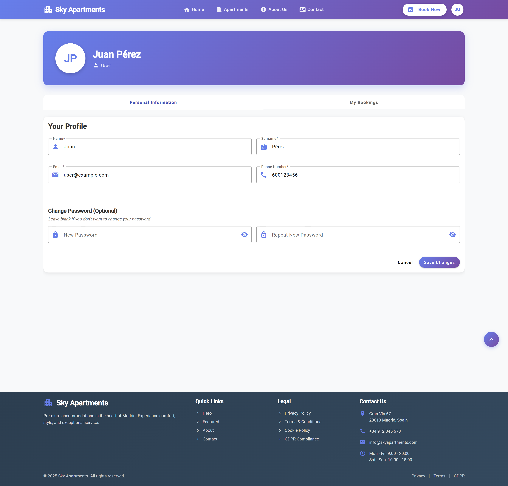
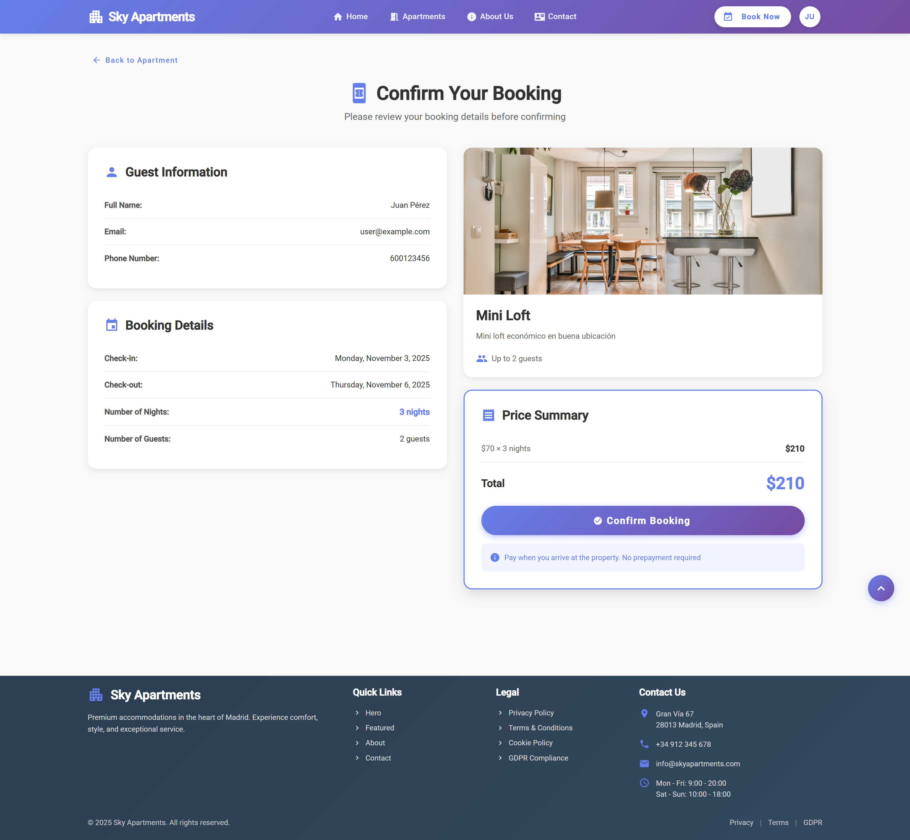

# Features

This document describes the features implemented in Sky Apartments version 0.1, illustrated with screenshots and detailed descriptions.

## 🏠 Apartment Browsing and Search

### Apartment Catalog

The main page displays all available apartments in a card-based layout. Each card shows:
- Primary apartment image
- Apartment name
- Number of maximum guests
- Price per night
- Key amenities (terrace, balcony, parking, etc.)
- FIlters (number of guests and services)

### Advanced Search and Filters

Users can filter apartments using multiple criteria:
- **Number of guests**: Select the desired capacity
- **Amenities**: Filter by terrace, balcony, parking, pool, etc.
- **Date availability**: Check apartments available for specific dates

All filters can be combined to refine search results effectively.

### Apartment Details

Each apartment has a dedicated detail page featuring:
- Complete description and amenities list
- Price per night
- Description
- Booking form 

## 👤 User Management

### Registration and Authentication

The application provides secure user authentication:
- Registration form with email validation
- Login system with Spring Security
- Password encryption for security
- Session management

### User Profile

Registered users can:
- View and edit their personal information
- Update email and password

## 📅 Booking Management

### Make a Reservation

Registered users can book apartments:
- Select check-in and check-out dates
- Specify number of guests
- View total price calculation
- Receive booking confirmation

### Booking Confirmation

Before finalizing a reservation, users are presented with a comprehensive confirmation page that includes:
- Guest Information
- Booking Details
- Apartment Summary
- Price Summary
- Confirmation Action

Once confirmed, the booking:
- Is immediately added to the user's booking history
- Updates the apartment's availability calendar
- Can be viewed and managed by the user

### Booking History

Users can access their complete booking history:
- View all past and upcoming reservations
- See booking details (dates, apartment, price)
- Check booking status (confirmed, cancelled, completed)

## 🛠️ Administration Panel

### Apartment Management

Administrators have full CRUD operations:
- **Create**: Add new apartments with all details and images
- **Read**: View list of all apartments in the system
- **Update**: Edit apartment information and images
- **Delete**: Remove apartments from the catalog

## 🔒 Security Features

### Access Control
The application implements role-based access control:
- Anonymous users: Browse and search only
- Registered users: Booking capabilities
- Administrators: Full system management

### HTTPS Communication
All communication with the server is secured using HTTPS on port 443.

### Error Handling

Custom error pages maintain the application's visual style:
- 404 error for non-existent pages
- 403 error for unauthorized access
- 500 error for server issues
- 503 error for server not available
---

*All features illustrated above are fully functional in version 0.1*