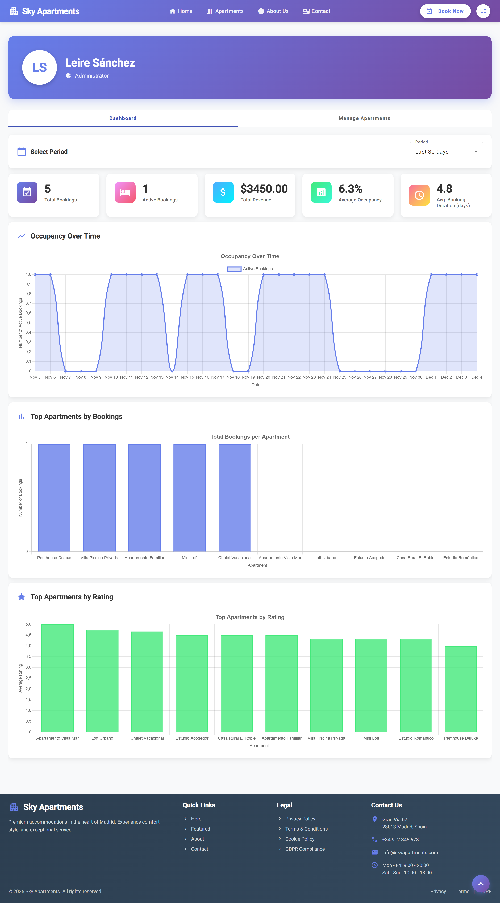

# Features

This document describes the features implemented in Sky Apartments version 0.2, illustrated with screenshots and detailed descriptions.

## 🏠 Apartment Browsing and Search

### Apartment Details & Gallery

Each apartment has a dedicated detail page featuring:
- **Media Gallery**: Support for multiple high-quality images per apartment
- **Interactive Calendar**: Visualizes real-time availability (dates blocked/available)
- Complete description and amenities list
- Price per night
- **Guest Reviews**: List of past comments and ratings

## 📅 Booking and Reviews

### Booking  Notifications

The system manages the booking lifecycle:
- **Email Notifications**: Users receive automated emails for booking confirmations, cancellations, and updates.
- **Immediate Sync**: Confirmed bookings instantly update the global availability calendar.
- Comprehensive summary page with all reservation details.

### Reviews

Users can access their complete booking history to:
- View past and upcoming reservations
- Cancel active reservations
- **Rate and Review**: After a stay is completed, users can rate the apartment (1-5 stars) and write a text review about their experience.

## 🛠️ Administration Panel

### Statistics Dashboard

A comprehensive dashboard providing business insights:
- **Revenue Chart**: Visual representation of revenue per month
- **Key Metrics**: Average booking duration and total occupancy
- **Top Performers**: List of Top 10 apartments by user rating

---

*All features illustrated above are fully functional in version 0.2*

---
[👉 Go back](/README.md)