# Features

This document describes the features implemented in Sky Apartments version 1.0, illustrated with screenshots and detailed descriptions.

## 🏠 Apartment Browsing and Search

### Advanced Filtering System

The search system allows users to find their perfect apartment through:
- **Guest Capacity**: Filter by number of guests
- **Amenities**: Select desired features (terrace, balcony, parking, pool, etc.)
- **Date Availability**: Check apartments available for specific dates
- **Minimum Rating**: Filter apartments by user ratings (1-5 stars)
- **Combined Filters**: All criteria can be combined for precise results

### Apartment Details & Gallery
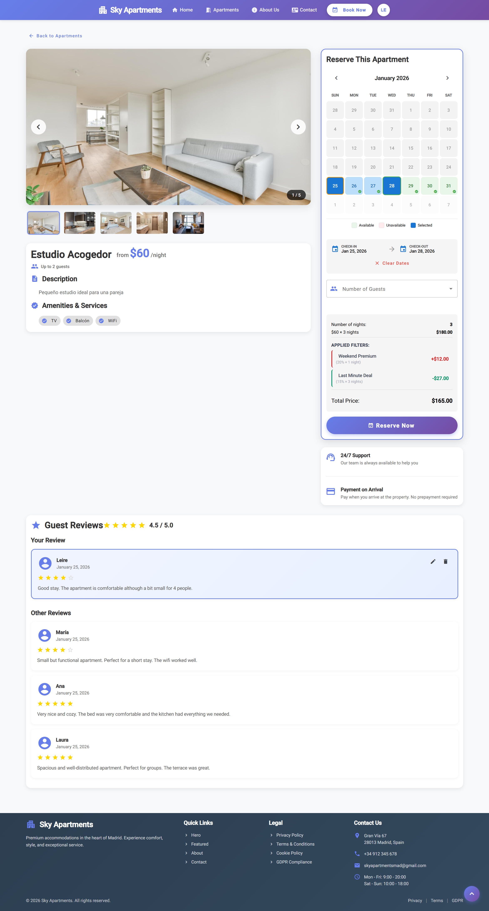

Each apartment has a dedicated detail page featuring:
- **Media Gallery**: Support for multiple high-quality images per apartment
- **Interactive Calendar**: Visualizes real-time availability with dynamic pricing
- **Dynamic Pricing Display**: Shows price variations based on season, occupancy, and booking lead time
- Complete description and amenities list
- Base price and current price per night
- **Average Rating**: Star rating based on user reviews
- **Guest Reviews**: List of past comments and ratings with detailed feedback

## 📅 Booking and Reviews

### Booking Notifications
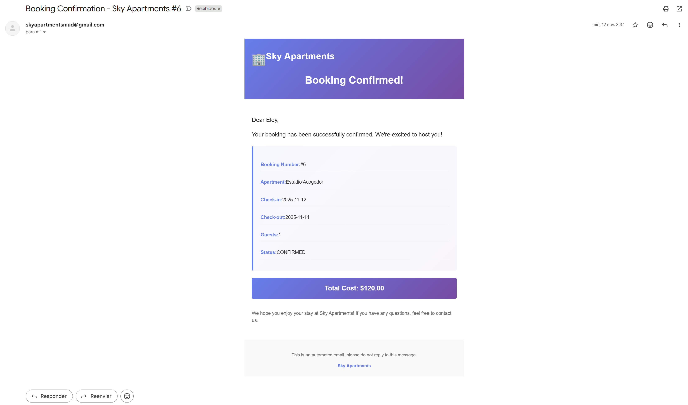
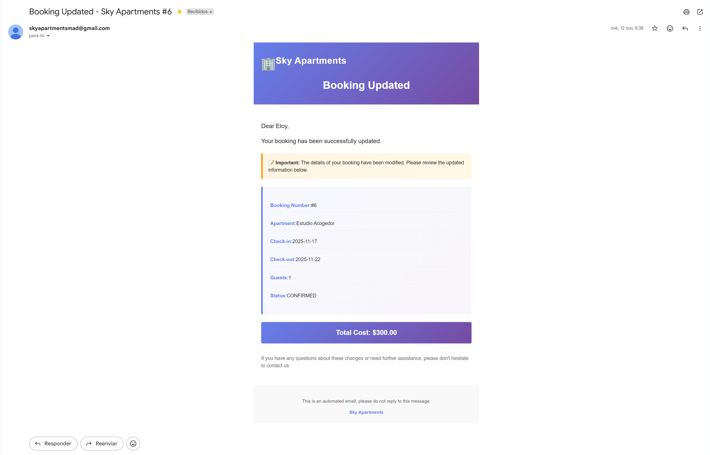
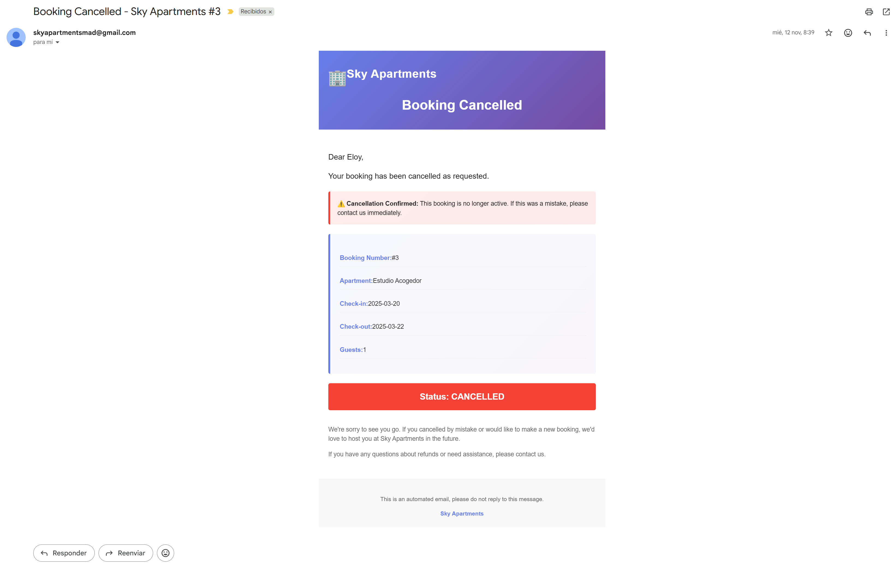
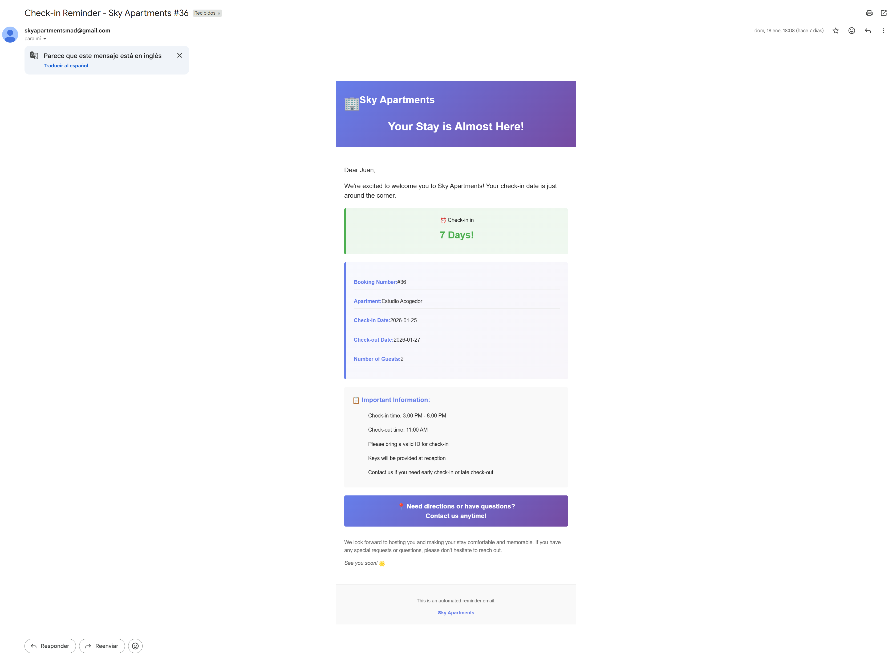

The system manages the complete booking lifecycle:
- **Email Notifications**: Users receive automated emails for:
  - Booking confirmations with pricing breakdown
  - Booking cancellations
  - Booking updates
  - **Check-in reminders** sent before arrival date
- **Immediate Sync**: Confirmed bookings instantly update the global availability calendar
- **Price Transparency**: Detailed pricing breakdown showing base price and applied multipliers
- Comprehensive summary page with all reservation details

### Reviews and Ratings

Users can access their complete booking history to:
- View past and upcoming reservations with status indicators
- Cancel active reservations
- **Rate and Review**: After a stay is completed, users can:
  - Rate the apartment from 1 to 5 stars
  - Write detailed text reviews about their experience
  - View their submitted reviews
- **Public Display**: Reviews appear on apartment detail pages for other users

## 🛠️ Administration Panel

### Statistics Dashboard
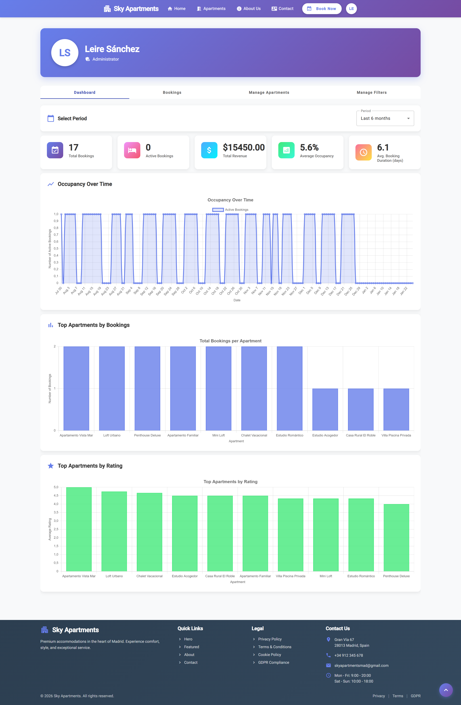

A comprehensive dashboard providing business insights:
- **Key Performance Indicators**:
  - Total number of bookings
  - Active bookings count
  - Total revenue generated
  - Average occupancy rate
- **Visual Analytics**:
  - Revenue per month (line chart)
  - Occupancy over time (trend chart)
  - Top 10 most booked apartments (bar chart)
  - Top 10 apartments by rating (ranking chart)
- **Business Metrics**:
  - Average booking duration
  - Occupancy trends and patterns
  - **Price history and analytics**

### Apartment Management
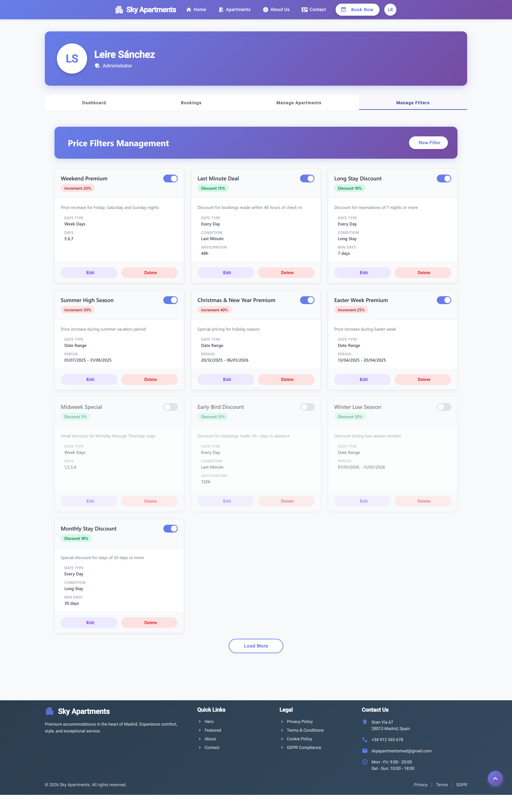

Complete CRUD operations for apartment management:
- **Create/Edit Apartments**: Full form with all property details
- **Media Gallery Management**: Upload, organize, and delete multiple images
- **Dynamic Pricing Configuration**:
  - Set base price per apartment
  - Configure weekend/weekday multipliers
  - Define seasonal pricing (low, medium, high season dates)
  - Set occupancy-based price adjustments
  - Configure last-minute and advance booking modifiers
  - Create special pricing for holidays and events
  - Set up long-stay discount rules
- **Amenities Management**: Toggle available features (parking, pool, terrace, etc.)
- **Location Settings**: Configure address, city, and neighborhood

### Booking Management
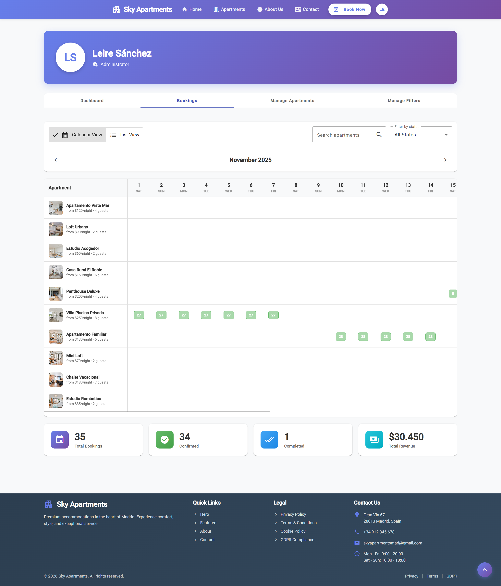

Advanced booking administration interface:
- **Comprehensive Booking List**: View all system reservations
- **Advanced Filters**:
  - Filter by status (pending, confirmed, cancelled, completed)
  - Filter by date range
  - Search by apartment name
- **Quick Statistics**: Summary of bookings by status
- **Pagination**: Efficient handling of large booking volumes

## 🔐 Security and User Management

### User Authentication
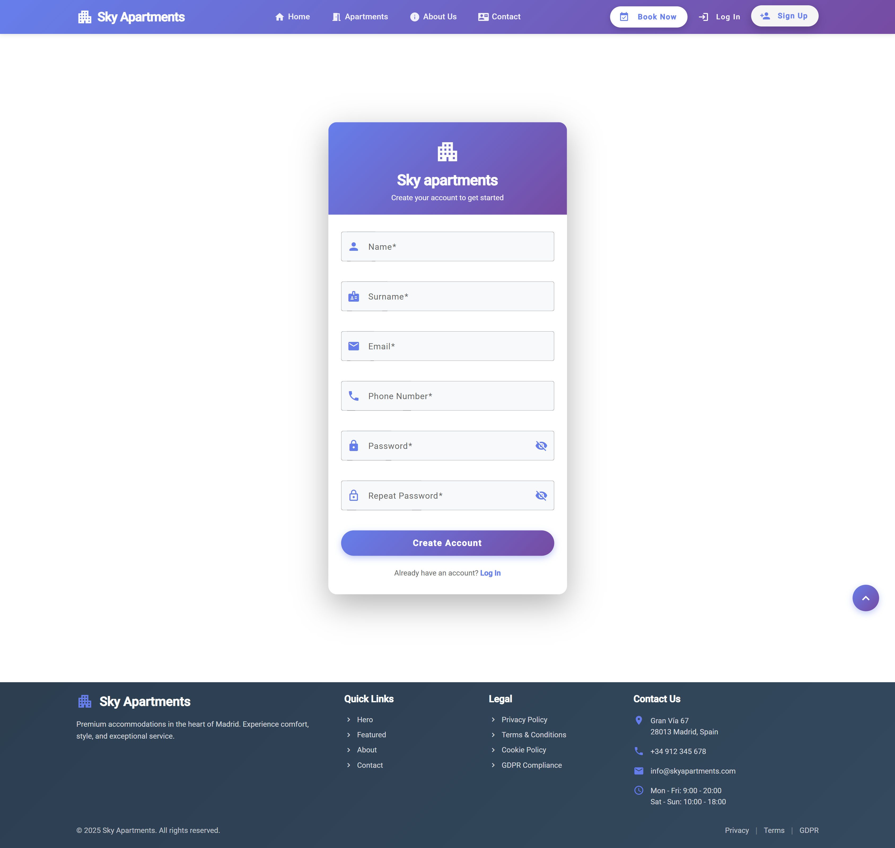
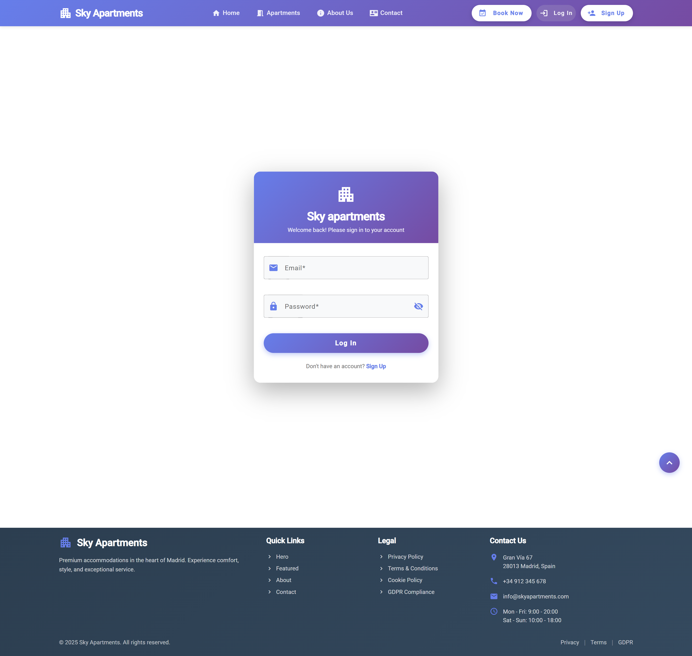

Secure user management system:
- **Registration**: Email-validated account creation
- **Authentication**: Secure login with Spring Security
- **Role-Based Access**: Different permissions for users and administrators
- **Profile Management**: Users can update their personal information

### User Profile
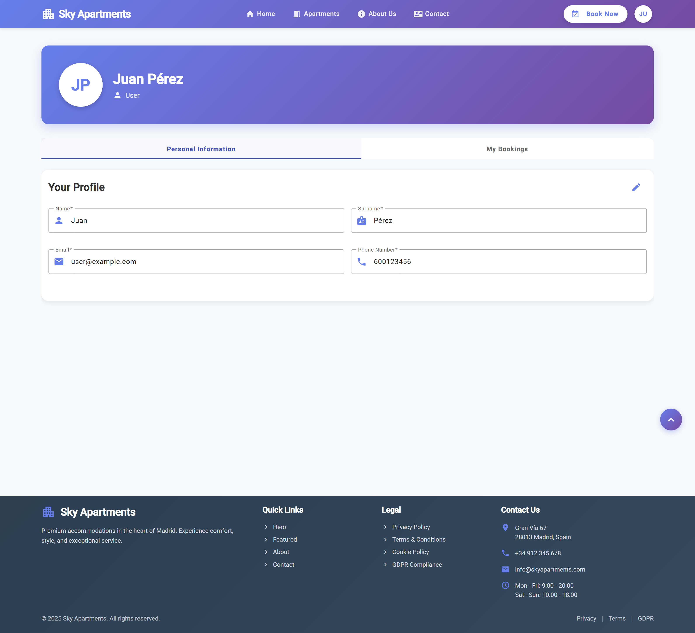

Personal user area featuring:
- Editable profile information
- Complete booking history with status tracking
- Quick access to active reservations
- Review management for past stays

---

## 🎯 Technical Highlights

### RESTful API
- All endpoints following `/api/v1` convention
- Proper HTTP methods (GET, POST, PUT, DELETE)
- Appropriate status codes and error handling
- Pagination support for list operations
- Query parameters for filtering and searching

### Security
- HTTPS communication on port 443
- Spring Security integration
- Role-based authorization (USER, ADMIN)
- Secure password encryption
- Session management

### Deployment
- Fully Dockerized application
- Docker Compose orchestration
- Published on DockerHub
- Self-signed SSL certificate for HTTPS
- Sample data preloaded for demonstration

---

*All features illustrated above are fully functional in version 1.0*

---
[👉 Go back](/README.md)